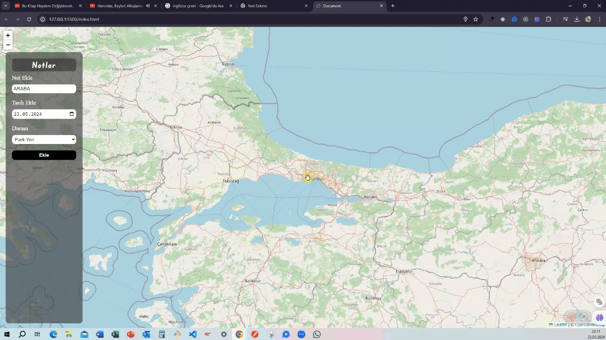

# Map Notes  

Bu depo, kullanıcıların belirli konumlara notlar eklemesini ve bu notları harita üzerinde görselleştirmesini sağlayan bir web uygulamasını içerir. Proje, kullanıcıların seyahat ettiği yerleri, ilginç yerleri veya hatırlamak istedikleri diğer noktaları harita üzerinde işaretlemelerine olanak tanır ve bu noktalara notlar eklemelerine izin verir. 

# Özellikler  

- Not Ekleme: Kullanıcıların belirli bir konuma notlar eklemesine olanak tanır. Örneğin, bir restoranı, turistik bir yeri veya bir etkinlik noktasını işaretleyebilirler. 

- Notları Görüntüleme: Kullanıcıların harita üzerindeki işaretlenmiş noktalara tıklayarak notları görüntülemesine olanak tanır. Örneğin, belirli bir restoranın açıklaması veya turistik bir yer hakkında notlar görüntülenebilir. 

- Harita İşaretlemesi: Kullanıcıların harita üzerinde noktaları işaretlemesine ve bu noktaları istedikleri zaman düzenlemesine veya kaldırmasına izin verir. 

# Kullanılar Teknolojiler  

- HTML5  

- Css  

- JavaScript  

# Ekran Görüntüsü  

